# 课表模块

**项目中MQ的使用**

> 订单支付模块和学习模块是解耦的 用户在购买课程或者退款后会通过MQ异步发送给学习服务 自动将用户购买的课程加入/删除到用户课表中

**要是消息丢失怎么办**

> 对于消息丢失一般有两种解决方案 一种是MQ中设置同步刷盘后再返回ack 如果使用集群的话等待副本都写入日志后才返回ack 另外一种则是通过操作记录 定期比对操作记录进行补偿
>
> 但是MQ同步刷盘的话性能会显著下降 因此一般不采用这种机制
> 而操作记录一般在重要业务中才会使用到 对于加入课表这个业务消息丢了的情况下让用户从订单中手动把课程到课表或者联系客服加入即可

**LearningLessonController**

由于课表中学习进度、学习时间、最近学习课程经常发生变更，还有排序的业务 而且每个用户需要单独存一份 所以不适合存入redis缓存

| **编号** | **接口简述**                                    | **请求方式** | **请求路径**              |
| :------- | :---------------------------------------------- | :----------- | :------------------------ |
| 1        | 支付或报名课程后，立刻加入课表                  | MQ通知       |                           |
| 2        | 分页查询我的课表                                | GET          | /lessons/page             |
| 3        | 查询我最近正在学习的课程                        | GET          | /lessons/now              |
| 4        | 根据id查询指定课程的学习状态                    | GET          | /lessons/{courseId}       |
| 5        | 删除课表中的某课程                              | DELETE       | /lessons/{courseId}       |
| 6        | 退款后，立刻移除课表中的课程                    | MQ通知       |                           |
| 7        | 校验指定课程是否是课表中的有效课程（Feign接口） | GET          | /lessons/{courseId}/valid |
| 8        | 统计课程学习人数（Feign接口）                   | GET          | /lessons/{courseId}/count |

------

## 支付/退款异步添加/删除课表

- 消费者

teachub-learning进行消息监听，监听到消息后通过rpc调用course服务通过课程id查询课程信息并将课表信息加入learning数据库

- 生产者

  - 免费课程下单（在交易服务）成功后发送mq
  - 支付宝/微信调用notify接口 验证参数后发送支付成功异步消息，交易服务接收到消息后发送mq让课表服务添加课程

  - 退款操作：用户申请退款 管理员审批通过后发送异步(executor)请求给pay服务，pay服务返回成功结果后发送mq给课表服务进行课程删除

------

## 分页查询我的课表

- rpc调用课表服务获取基本信息写入课表
- 分页条件为页码、size、查询字段、是否升序

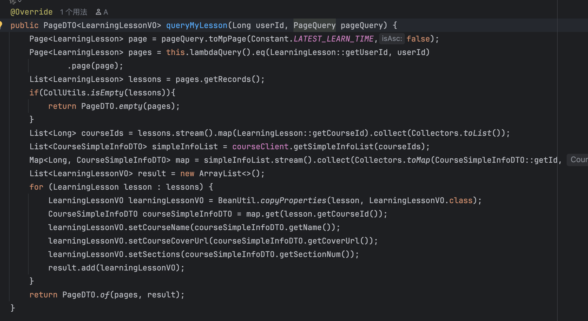

### 想法

- 考虑到课表中学习进度、学习时间、最近学习课程经常发生变更，还有排序的业务 而且每个用户需要单独存一份 所以不适合存入redis缓存
- 缓存命中率不高而且为每个用户维护缓存内存占用极大

------

# 学习计划和进度模块

**LearningRecordController**

整体流程如图：

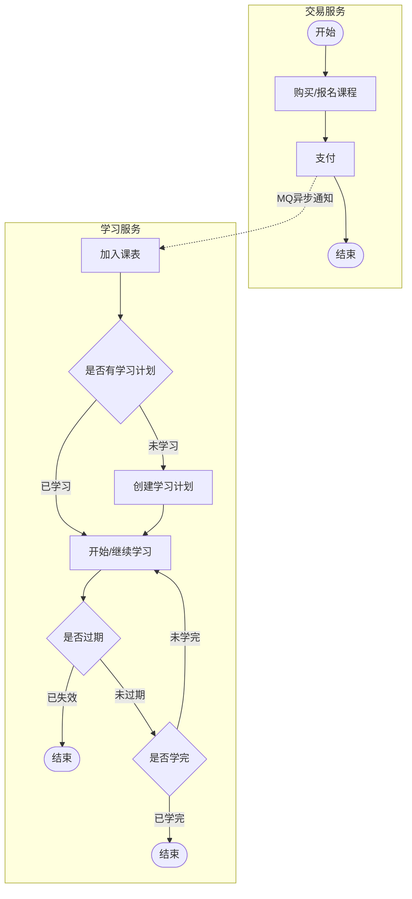

------

## 查询学习记录

**给课程服务rpc调用**

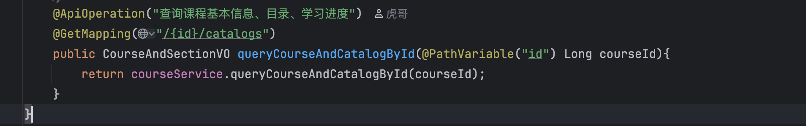

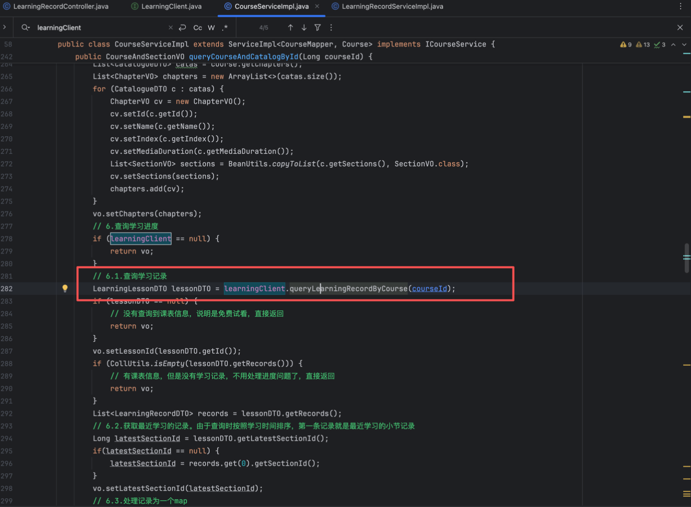

- 获取当前登录用户id
- 根据courseId和userId查询LearningLesson
- 判断是否存在或者是否过期
  - 如果不存在或过期直接返回空
  - 如果存在并且未过期，则继续
- 查询lesson对应的所有学习记录

#### 优化

**可以在返回数据的同时在Redis加入播放进度缓存 给下面提交学习记录使用**

------

## 提交学习记录	

- 考试比较简单，只要提交了就说明这一节学完了。
- 视频比较麻烦，需要记录用户的播放进度，进度超过50%才算学完。因此视频播放的过程中需要不断提交播放进度到服务端，而服务端则需要保存学习记录到数据库

提交学习记录处理流程如图：

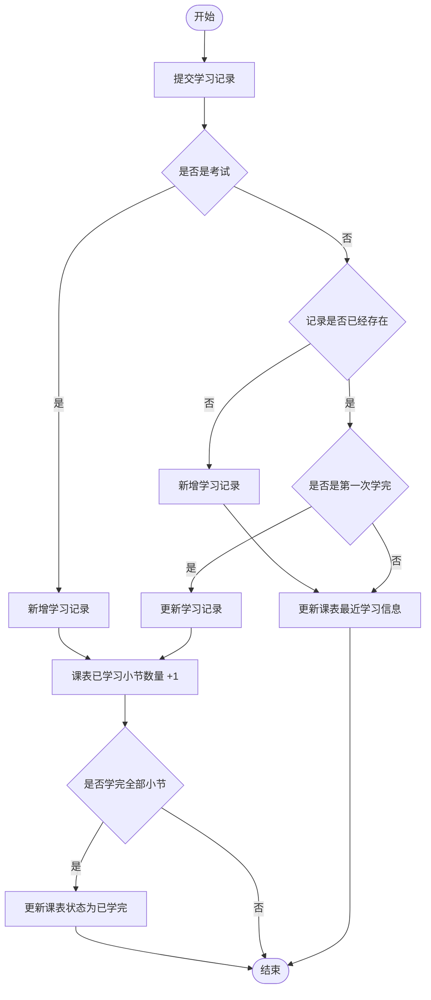


------

## 高并发优化学习记录提交

**流程**

> 项目中原本的设计是前端维护一个定时器 每15秒将用户当前的视频播放进度提交然后更新数据库 这种设计对数据库的压力是很大的 然后我就采用了Redis缓存+Java的这个DelayQueue的方式进行改造 前端提交播放进度的时候先在Redis中修改进度 同时提交一个20s的延迟任务 取任务时通过线程池进行进度对比 如果延迟任务和Redis所记录的一样就说明没有更新的记录提交了 代表用户已经离开 然后就将记录同步到数据库中 当然了可能出现Redis丢消息导致Redis中的进度和延迟队列中的对不上 但是这个业务对数据一致性不那么敏感 因此可以容忍

**流程图：**

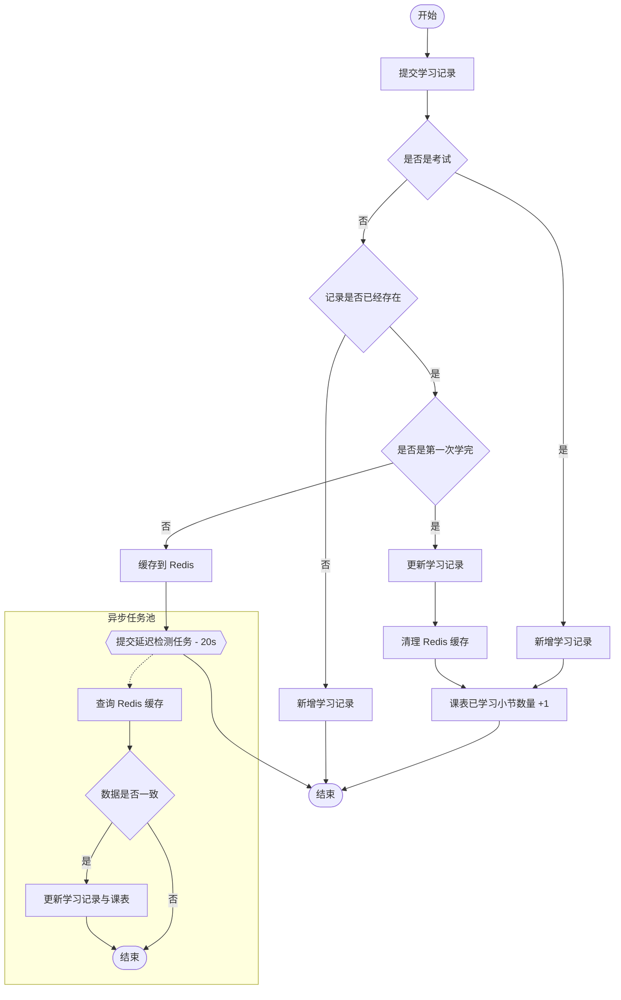


变化最大的有两点：

- 提交播放进度后，如果是更新播放进度则不写数据库，而是写缓存
- 需要一个定时任务，定期将缓存数据写入数据库

变化后的业务具体流程为：

- 1.提交学习记录
- 2.判断是否是考试
  - 是：新增学习记录，并标记有小节被学完。走步骤8
  - 否：走视频流程，步骤3
- 3.查询播放记录缓存，如果缓存不存在则查询数据库并建立缓存
- 4.判断记录是否存在 
  - 4.1.否：新增一条学习记录
  - 4.2.是：走更新学习记录流程，步骤5
- 5.判断是否是第一次学完（进度超50%，旧的状态是未学完）
  - 5.1.否：仅仅是要更新播放进度，因此直接写入Redis添加到延迟队列后结束
    然后延迟队列不断取任务，线程池异步判断延迟队列中的值和缓存记录是否相等 相等则代表用户离开并写入数据库
  - 5.2.是：代表小节学完，走步骤6
- 6.更新学习记录状态为已学完
- 7.清理Redis缓存：因为学习状态变为已学完，与缓存不一致，因此这里清理掉缓存，这样下次查询时自然会更新缓存，保证数据一致。
- 8.更新课表中已学习小节的数量+1
- 9.判断课程的小节是否全部学完
  - 是：更新课表状态为已学完
  - 否：结束


### 延迟队列进行优化

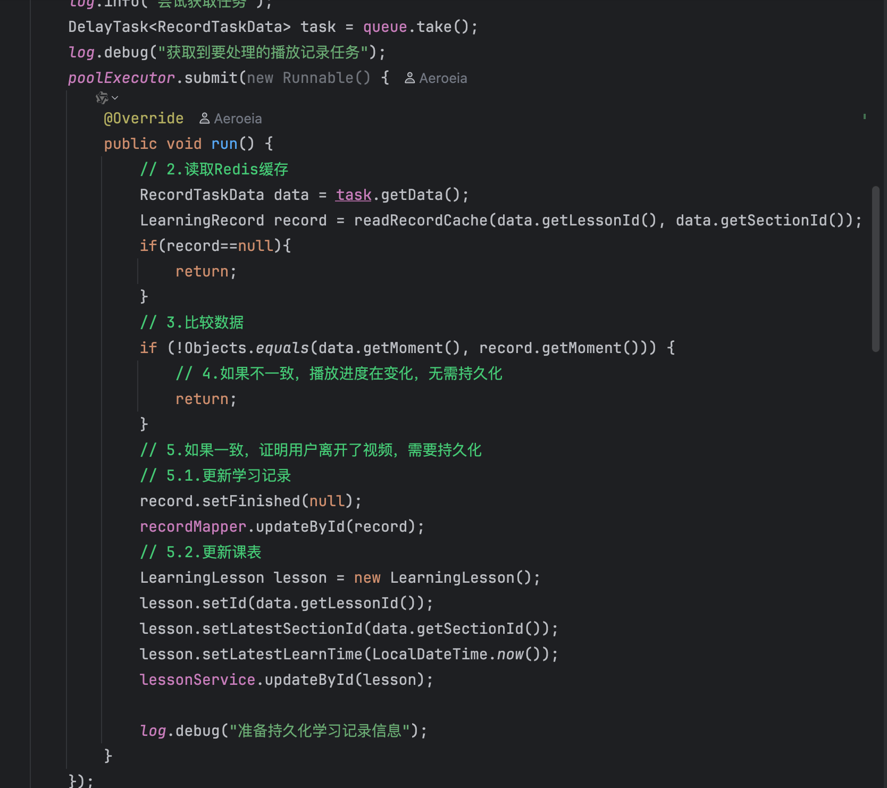

**多实例也没问题 因为最多只会有一个实例中的延迟队列的新记录值和缓存中相等**

------

# 问答模块

## 新增问题回答与查询问题回答

**感觉可以做出以下优化：**

- 使用本地锁+分布式锁组件+限流标识防短时间重复提交
- 在redis维护一个hash表记录每个用户点过赞的评论（项目也确实是这样做的） 然后点赞数量也是维护一个hash表 新增问题、评论的操作就还是直接落库（加个ip限流防刷即可，一般并发不会高，主要是查询），查询时进行缓存即可

### 想法&流程

- 使用本地锁+分布式锁组件+限流标识防短时间重复提交
- 新增问题/回答时进行数据库缓存双写（一般来说写操作不会很多 读占多数），异步写入缓存，使用Zset存id根据写入时间排序 两个Hash分别记录实体和评论数 
- 读取的时直接根据zset的时间顺序读（天然分页） 然后在Hash中查找
- ~~读取点赞数通过Redis的Hash~~，是否点赞通过Set 统计点赞数直接通过set获取
- 根据回答时间进行清除冷门缓存 同时清除用户点赞记录

```java
// 1. ZSet存储ID和时间（用于排序和分页）
// question:replies:{questionId} -> replyId with timestamp as score
redisTemplate.opsForZSet().add(replyListKey, replyId.toString(), System.currentTimeMillis());

// 2. Hash存储实体详情
// reply:info:{replyId} -> {id, content, userId, createTime, ...}
Map<String, Object> replyInfo = new HashMap<>();
replyInfo.put("id", reply.getId());
replyInfo.put("content", reply.getContent());
replyInfo.put("userId", reply.getUserId());
// ... 其他字段
redisTemplate.opsForHash().putAll(infoKey, replyInfo);

// 3. 独立Hash存储统计信息
// reply:stats:{replyId} -> {answerCount: 5, likeCount: 10}
Map<String, String> stats = new HashMap<>();
stats.put("answerCount", "5");
stats.put("likeCount", "10");
redisTemplate.opsForHash().putAll(statsKey, stats);
```

**方案二（不利于更新）**

- 使用本地锁+分布式锁组件+限流标识防短时间重复提交
- 新增问题/回答时进行数据库缓存双写（一般来说写操作不会很多 读占多数），异步写入缓存，使用Zset根据写入时间排序member为消息实体  Hash分别记录实体和评论数
- 读取的时直接根据zset的时间顺序读（天然分页） 评论数在Hash中读取
- ~~读取点赞数通过Redis的Hash~~，是否点赞通过Set 统计点赞数直接通过set获取
- 根据回答时间进行清除冷门缓存 同时清除用户点赞记录

```java
// ZSet存储：member为JSON实体，score为时间戳
// reply:list:{questionId} -> JSON serialized reply entity with timestamp as score

// Hash存储：独立维护评论数量
// reply:stats:{replyId} -> {commentCount: 5}
```

**最终流程**

- 使用幂等锁防止短时间重复提交 防刷的话可以通过MD5标识+时间窗口进行计数
- 还是直接根据数据库读写省事  优化的话可以考虑前面说的
- 新增回答异步更新记录数 抛异常通过日志记录

------

## 管理端分页查询问题

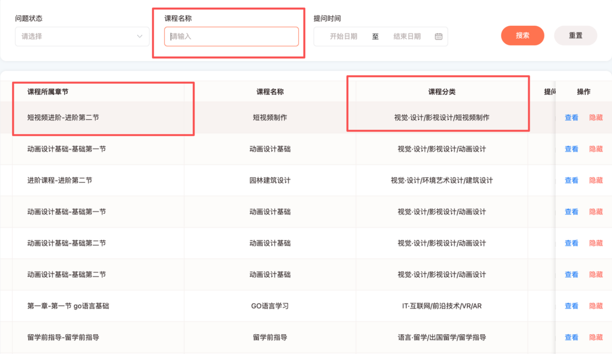

需要显示课程章节和课程分类、同时需要根句关键字模糊查找

- Es模糊查找返回课程id

- 课程章节是通过es返回的id查询课程后再查询目录得到的 进行了两次rpc

- 构建所有分类的三级缓存 利用这个缓存进行拼接

  **Caffeine**

  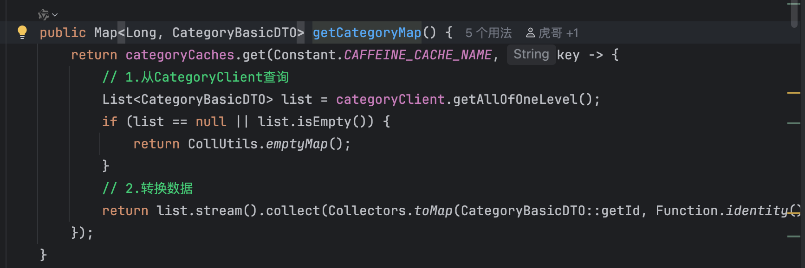

  **Redis**

  这一块代码做的有点瑕疵 统计三级目录数量没有必要 其实只要返回课程包含的分类id拼接即可 所以只要在redis记录所有课程分类就行

  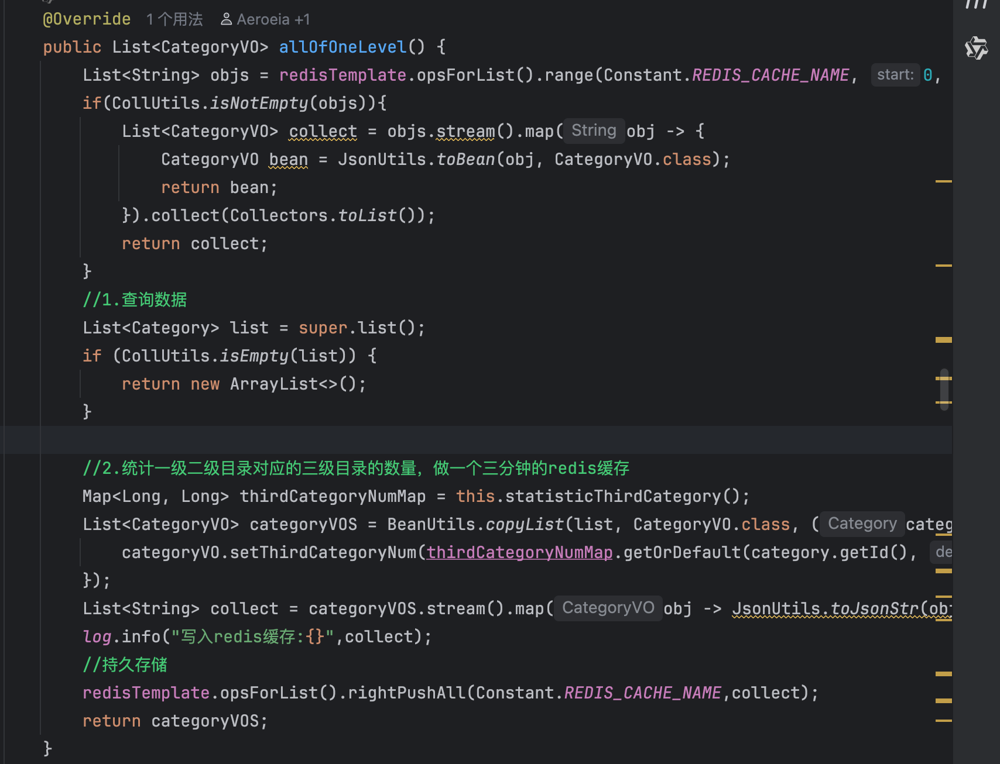

**优化点**

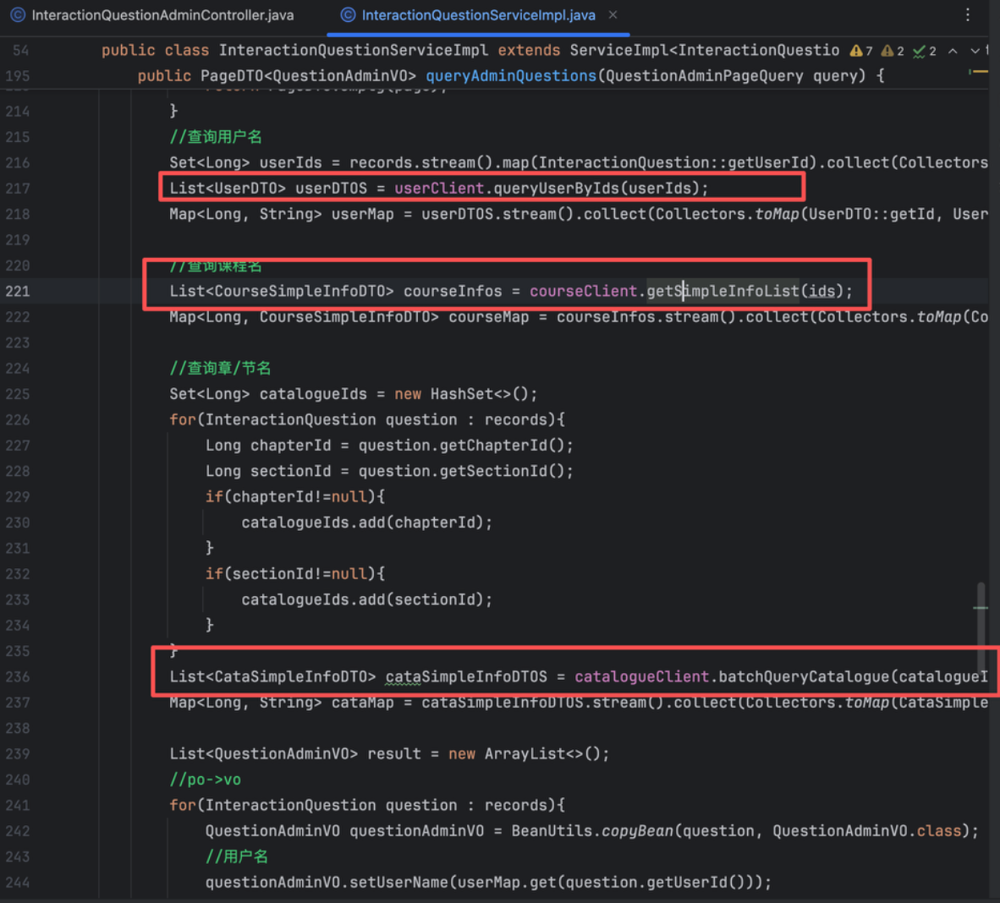

- 课程信息可以进行hash缓存 缓存时间可以稍长 因为这个不怎么会进行改变
- 目录、章节信息同上
- 用户信息由于数据量比较庞大 不太适合全量存储 我想到的是将最近有所活动（发表问题、评论）的用户信息进行缓存

### 想法&流程

**后台进行缓存意义不大但大致流程可以这样**

- 通过es查询出课程id（如果关键字存在）
- 三级缓存分类信息 Redis使用多个Hash缓存 分别存 第一分类 id-name 多个第一分类id下的第二分类 id-name 三级分类同理
- 三级缓存课程的基本信息（章节、分类、名字）结构为hash：课程id+信息
- 通过缓存中的问答信息进行拼接返回

**以下是我想到用户端查询课程的缓存**

- 分别对课程介绍、目录进行三级缓存
- 问答和笔记在其他模块都有对应的缓存了
- 购买状态还是直接查数据库
- 分类信息用hash id+信息（名字 层级 父分类id）持久缓存

------

# 点赞系统

**最终改进：**

- 一个set存postId-userId映射 设置过期时间 访问可以续期 过期后从db读取
- 一个set/list存新增用户id 通过定时任务更新db 注意要用lua保证原子性 不然多实例下会造成新来的被删掉的情况
- 点赞总数不必再通过zset更新了 读取set即可

浏览数：

- 通过String存储 访问则自增 过期就从db读取

**初版**

> 通过Redis中set结构存储用户点赞行为 key为点赞业务的Id 里面存储点赞过的用户 这样在分页查询的时就可以快速判断用户是否点过赞（如果key过期 重新在Mysql读取） 用户点赞时在数据库中进行记录并写入Redis 通过一个定时任务(20s) 定时将点赞数通过MQ同步到业务中 防止消息丢失产生的问题 可以在人流量不高的时候（深夜） 通过rpc比对业务中点赞数和记录中是否一致 用户点赞后计算当前业务下点赞数 并更新到zset中 定时任务更新的时候可以通过popMin方法取出同步 冷热分离

**为什么利用Zset结构来存储？**

> 这里zset相当于一个中间集合 用户点赞后将更新后的点赞数写入到zset 这样就知道哪些数据是需要更新的 而不用每次定时任务同步的时候都将所有业务同步一遍 这样性能损耗较大
> 使用zset的好处就是zset的提供popMin的原子性删除操作，同时通过id更新方便

**如果Redis消息丢了怎么办**

> 通过一个定时任务 在深夜的时候比对Redis中记录和数据库记录是否一致 并且比对业务点赞数量是否一致

点赞服务抽取成一个单独的微服务 因为必要时可以支持多种不同业务的点赞功能

## 新增点赞/取消点赞

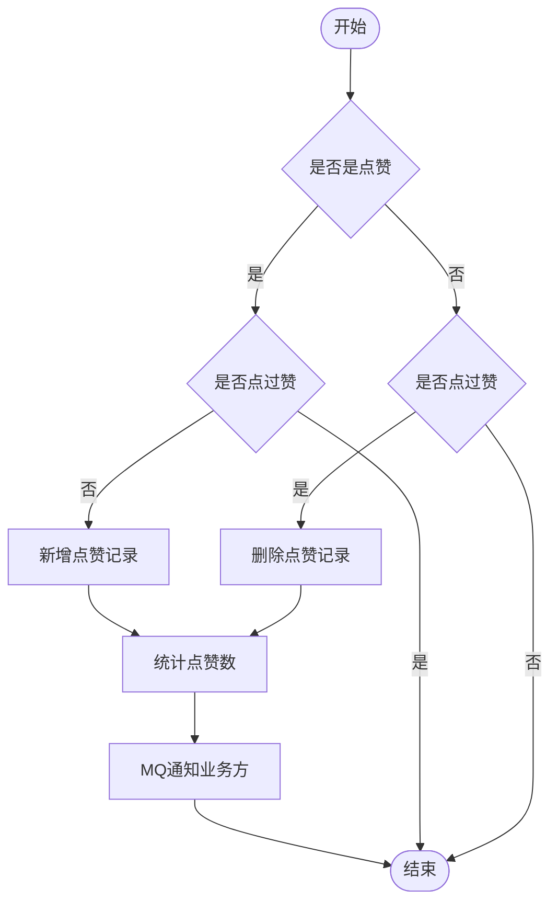


需要统计点赞数再发送给mq是因为由于网络问题用户可能点了两次赞

**改进**

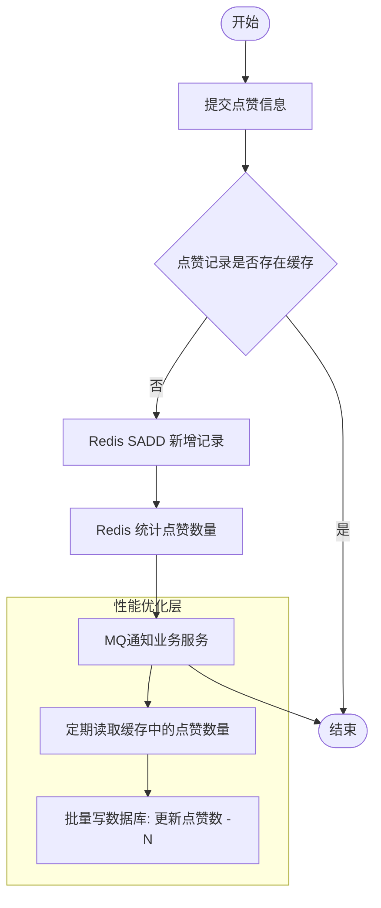


- 采用redis的set结构记录每个bizId下的点赞用户
- 基于redis更新/查询点赞相关业务 并定期落库~~（或者我觉得可以点赞双写数据库和缓存，查询时查缓存）~~
- 防止redis压力过大 冷门（长时间）数据从redis清除
- 近期数据在redis访问不到自己是否点过赞则代表没有 冷门数据则进行数据库查询 **设置一个门槛时间（根据问题的时间）**

**管道操作读取是否点赞**

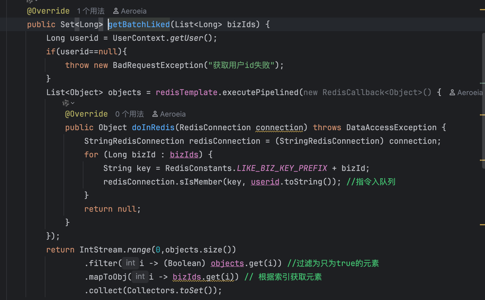

------

# 积分系统

> 签到的时候数据库写入一条记录 同时在bitmap进行记录 通过异步线程更新zset中的积分
>
> 异步线程能防止消息丢失且执行速度快 实时性高
>
> Redis可能丢消息 解决方法就是定时进行记录比对 用户反馈、榜单结算时再进行检查

## 用户签到

- 使用BitMap进行记录

  - 确保Redis写入成功

    ```java
    Boolean result = redisTemplate.execute((RedisCallback<Boolean>) conn -> {
        conn.setBit(key.getBytes(), day, true);
        return true;
    });
    ```

  - 主从复制使用半同步模式（避免主宕丢）,

    > 等待至少 1 个从节点确认写入成功（等待最多 1 秒）。
    >
    > 这可以显著降低主从切换丢数据的概率。

- MQ异步更新积分记录 

  **防消息丢失、重复消费机制**

  - 写记录表
  - 同步等待发送成功（消息仍然可能丢 通过记录表补偿）
  - 手动ack（消息处理失败可以发消息通知管理员）并在redis中记录一个唯一消息标识

**可能重复消费原因**

| 场景       | 造成重复消费的原因    | 解决方案             |
| ---------- | --------------------- | -------------------- |
| 消费前宕机 | 消费完成未提交 offset | 幂等消费设计         |
| 生产端重试 | 网络抖动导致重复发送  | 开启 Kafka 幂等生产  |
| 主从切换   | offset 回滚           | 同步副本配置 (`ISR`) |

> 列的三类问题及解决思路：

1. **Redis 主从切换丢数据**
   - 可用 `AOF` + `appendfsync` 策略、`WAIT` 命令、`min-replicas-to-write`；或使用 Redis Raft / Redis Enterprise 提供强一致性；并在业务端做补偿（任务表/outbox）。
2. **MQ 主从切换丢数据**
   - Kafka：`acks=all` + `min.insync.replicas>=2` + `replication.factor>=3` + `unclean.leader.election=false`；启用 producer 幂等/事务。
   - RabbitMQ：持久队列 + 持久消息 + Publisher Confirms + 使用 Quorum Queues。
3. **消费者处理成功但 offset 未提交导致重复消费 / offset 延迟**
   - 最常用：`enable.auto.commit=false` + 手动 commit（业务成功后） + 幂等处理（唯一约束或消费日志）。
   - 更高级：Kafka 事务（sendOffsetsToTransaction）或将 offset 存 DB 并在同一 DB 事务内写业务数据与 offset（外部提交）。

------

# 排行榜

## 实时排行榜

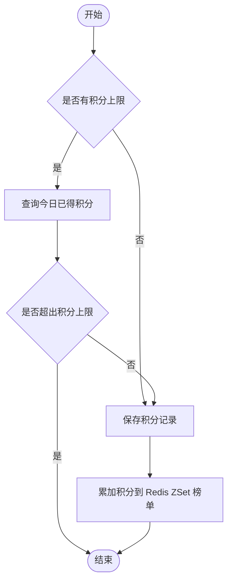


> 实时排行榜是根据Redis中zset进行的 zset中key为用户id score是用户的积分 因此天然实现了排行榜排序 当用户积分变动时 比如用户签到获得了积分 则异步更新到zset榜中 结算时间是每月月底 这时候通过xxl-job定时任务并结合mybatisplus动态表名创建新表存入历史榜单数据 

- 使用Zset进行积分排序
- 新增积分记录同时修改Redis中Zset数据
- 判断是否当前赛季并在Redis/Mysql进行分页查询

## 历史排行榜

- 分库分表

- 定时任务每个赛季初生成上赛季榜单

  - xxl-job创建新表
  - 将上赛季信息保存到新表
  - 清空redis缓存

### 动态表名插件

```java
package com.tianji.learning.config;

import com.baomidou.mybatisplus.extension.plugins.handler.TableNameHandler;
import com.baomidou.mybatisplus.extension.plugins.inner.DynamicTableNameInnerInterceptor;
import com.tianji.learning.utils.TableInfoContext;
import org.springframework.context.annotation.Bean;
import org.springframework.context.annotation.Configuration;

import java.util.HashMap;
import java.util.Map;

@Configuration
public class MybatisConfiguration {

    @Bean
    public DynamicTableNameInnerInterceptor dynamicTableNameInnerInterceptor() {
        // 准备一个Map，用于存储TableNameHandler
        Map<String, TableNameHandler> map = new HashMap<>(1);
        // 存入一个TableNameHandler，用来替换points_board表名称
        // 替换方式，就是从TableInfoContext中读取保存好的动态表名
        map.put("points_board", (sql, tableName) -> TableInfoContext.getInfo() == null ? tableName : TableInfoContext.getInfo());
        return new DynamicTableNameInnerInterceptor(map);
    }
}
```

- 在Mybatis-plus配置类中进行配置
- 使用ThreeadLocal传递表名

### XXL-JOB任务分片

- 通过集群分片处理任务
  - 确保每个实例任务处理不重复
  - 两实例同时写入Mysql在Mysql没达到瓶颈的时候会更快
  - 如果redis分片也能提高速度

```java
@XxlJob("savePointsBoard2DB")
public void savePointsBoard2DB(){
    // 1.获取上月时间
    LocalDateTime time = LocalDateTime.now().minusMonths(1);

    // 2.计算动态表名
    // 2.1.查询赛季信息
    Integer season = seasonService.querySeasonByTime(time);
    // 2.2.存入ThreadLocal
    TableInfoContext.setInfo(POINTS_BOARD_TABLE_PREFIX + season);

    // 3.查询榜单数据
    // 3.1.拼接KEY
    String key = RedisConstants.POINTS_BOARD_KEY_PREFIX + time.format(DateUtils.POINTS_BOARD_SUFFIX_FORMATTER);
    // 3.2.查询数据
    int index = XxlJobHelper.getShardIndex();
    int total = XxlJobHelper.getShardTotal();
    int pageNo = index + 1; // 起始页，就是分片序号+1
    int pageSize = 10;
    while (true) {
        List<PointsBoard> boardList = pointsBoardService.queryCurrentBoardList(key, pageNo, pageSize);
        if (CollUtils.isEmpty(boardList)) {
            break;
        }
        // 4.持久化到数据库
        // 4.1.把排名信息写入id
        boardList.forEach(b -> {
            b.setId(b.getRank().longValue());
            b.setRank(null);
        });
        // 4.2.持久化
        pointsBoardService.saveBatch(boardList);
        // 5.翻页，跳过N个页，N就是分片数量
        pageNo+=total;
    }

    TableInfoContext.remove();
}
```

- 利用XXL-JOB的任务链执行

  ```mermaid
  graph LR
      Step1(1.创建新赛季榜单表) --> Step2(2.持久化Redis上赛季数据)
      Step2 --> Step3(3.清理Redis旧榜单缓存)
      
      style Step1 fill:#f96,stroke:#333
      style Step2 fill:#f96,stroke:#333
      style Step3 fill:#f96,stroke:#333
  ```
  
  

------

# 优惠券管理

## 发放优惠券

- 立即发放

  - 检查当前状态是否为待发放

  - 优惠券信息存入Redis

    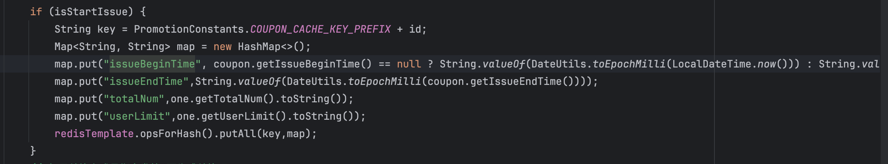

  - 判断是否兑换码兑换

- 定时发放

  - 检查当前状态是否为待发放
  - 判断是否兑换码兑换
  - 定时任务每120s检查一次 将到期发放的优惠券状态设为发放中

## 兑换码生成

> 兑换码生成是采用了Base32和签名的一种思想 项目中使用32位的一个自增id 并将这32位数分为8组 每组4位 并为每组设置一个权重 进行加权求和得到的结果就是签名 这个结果是一个14位的数字 这个权重数组则是密钥 同时为了避免被猜出规律 项目中准备了16组密钥 在32位自增id前拼接4位的随机值 值是多少就取第几组密钥 最终进行拼接 得到50位的数据 通过Base32编码得到10位字符

> **要求**
>
> - **可读性好**：兑换码是要给用户使用的，用户需要输入兑换码，因此可读性必须好。我们的要求：
>   - 长度不超过10个字符
>   - 只能是24个大写字母和8个数字：ABCDEFGHJKLMNPQRSTUVWXYZ23456789
> - **数据量大**：优惠活动比较频繁，必须有充足的兑换码，最好有10亿以上的量
> - **唯一性**：10亿兑换码都必须唯一，不能重复，否则会出现兑换混乱的情况
> - **不可重兑**：兑换码必须便于校验兑换状态，避免重复兑换
> - **防止爆刷**：兑换码的规律性不能很明显，不能轻易被人猜测到其它兑换码
> - **高效**：兑换码生成、验证的算法必须保证效率，避免对数据库带来较大的压力

- Base32转码

  - 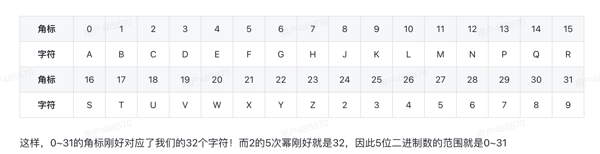

  - > 但是大家思考一下，我们最终要求字符不能超过10位，而每个字符对应5个bit位，因此二进制数不能超过50个bit位。
    >
    > UUID和Snowflake算法得到的结果，一个是128位，一个是64位，都远远超出了我们的要求。
    >
    > 那自增id算法符合我们的需求呢？
    >
    > 自增id从1增加到Integer的最大值，可以达到40亿以上个数字，而占用的字节仅仅4个字节，也就是32个bit位，距离50个bit位的限制还有很大的剩余，符合要求！

- 重兑校验算法

  - 基于BitMap：兑换或没兑换就是两个状态，对应0和1，而兑换码使用的是自增id.我们如果每一个自增id对应一个bit位，用每一个bit位的状态表示兑换状态

- 防刷校验算法

  - 准备16组秘钥。在兑换码自增id前拼接一个4位的**新鲜值**，可以是随机的。这个值是多少，就取第几组秘钥

### 算法实现

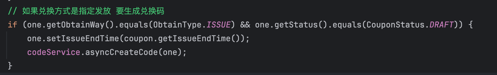

- 异步生成兑换码

- 将每张兑换码发放最大值记录到Redis中作为序列化自增最大值

- 从begin- maxNum进行序列号递增新增兑换码

- 计算兑换码

  - 根据id%密钥表作为新鲜值

    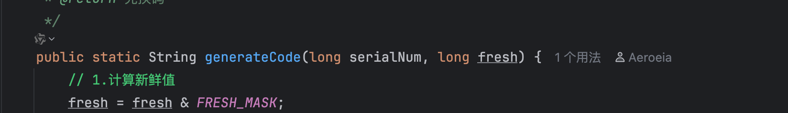

  - freshID<<32 ｜ 自增序列号

    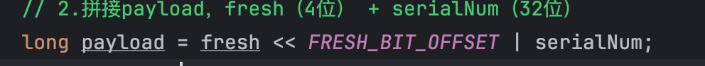

  - 不断取最右边4位进行计算 新鲜值4位+序列号32位共计算9次

    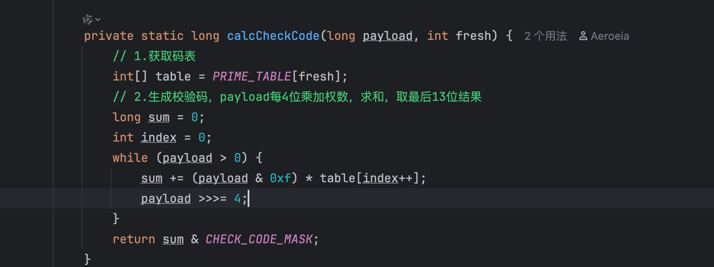

  - 异或混淆数据

    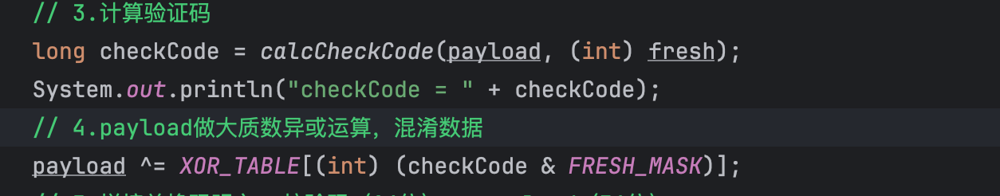

  - 拼接计算好的密钥值

    

- 将生成好的兑换码存到数据库中

- 在Redis中存每个优惠券最大序列号

------

# 领取优惠券

## 分页查询优惠券

**改造**

> 发放优惠券同时在Redis进行缓存 基于Redis进行判断即可

- Redis中采用Hash记录一个用户领取过的优惠券和次数或者用String的自增
- 通过Redis中将优惠券存储分为手动领取和兑换码兑换两种key
- 通过Redis进行优惠券查询并进行后续判断

------

## 领取优惠券

> 项目中分为直接领取优惠券和兑换码兑换优惠券
>
> 兑换码兑换基于BitMap和Hash进行的 BitMap通过自增id作为兑换码的序列号 同时一个Hash用于记录优惠券的兑换码id范围 兑换的时候先解析出序列号id 然后检查是否在兑换范围呢 并通过BitMap检查是否超出范围 
>
> 通过MQ异步扣减数据库（削峰填谷）在Redis和Mysql分别加入记录对账
> 如果redis宕机导致没成功 那么就会导致超卖情况 解决方法就是在兑换码加唯一索引

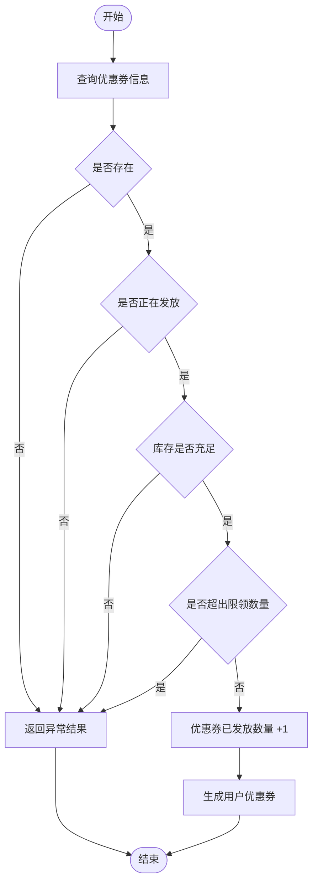


- 加分布式锁 以优惠券id为key
- 基于Redis进行校验、扣减库存
- MQ异步更新数据库中余票和用户领票信息

**优化**

1. 先获取bit位看兑换码是否被兑换 若已被兑换则返回
2. 扣减库存和兑换码 同时记录一条操作记录 发送MQ
3. 消费MQ消息 用户领券以及更改兑换码状态 同时新增操作记录

------

# 优惠券智能推荐

### 优惠券分类

- 无门槛券
- 每满减券（有上限）
- 满减券
- 满减打折券（有上限）

------

### 最优解筛选

- 初筛 首先实现对用户券（UserCoupon）的查询，查询条件有两个：

  - 必须属于当前用户
  - 券状态必须是未使用
  - 订单总价超过门槛

  > 查询出用户下可用的优惠券 并通过订单总价初步筛选出超过门槛的优惠券 

- 细筛

  - 首先要基于优惠券的限定范围对课程筛选，找出可用课程。如果没有可用课程，则优惠券不可用。
  - 然后对可用课程计算总价，判断是否达到优惠门槛，没有达到门槛则优惠券不可用

  > 基于初筛后的优惠券进行筛选 并查询数据库得到剩余优惠券的可用范围 然后统计传入的课程在此范围内的总价是否超过优惠券的门槛 进一步筛选出剩余可用优惠券

- 查找最优解

  - 基于全排列组合出所有使用顺序（==因为优惠券可以叠加使用 但是会重新计算每次使用完一个券的价格再传给下一个券 优惠价可能会造成不同==）
  - 找出相同优惠金额下使用券最少的集合、相同券下金额最大的集合并取交集找到最优组合

  > 进行全排列优惠券 然后根据优惠券规则使用completablefuture并发计算出每种排列下的优惠价，然后找出相同优惠金额下使用券最少的集合、相同券下金额最大的集合并取交集找到最优组合并排序返回给前端

分为初筛细筛可以缓解数据库查询的一个压力 初筛过滤掉一些不符合的优惠券 在细筛的时候就不用全部都查优惠券可用范围

------

